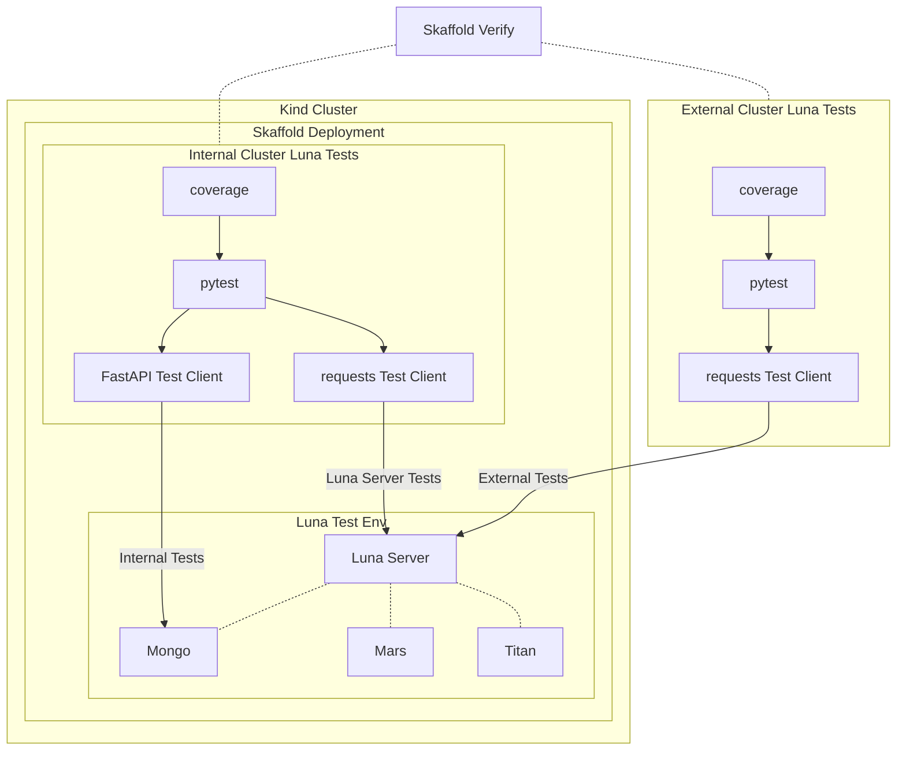

<br />
<p align="center">
    
    <h3 align="center">Microservice Template</h3>
    <p align="center">
        Microservice Template Repository from Juno Innovations
    </p>
</p>

## Usage

This is a template repository for creating new microservices at Juno Innovations. It is designed to be the 
easiest jumping off point for creating new microservices for kubernetes.

## Pre-requisites

The following tools are required to be installed on your machine to use this repository:

- [devbox](https://www.jetify.com/devbox) - Development environment tooling

We have streamlined the development process for microservices at Juno Innovations by using devbox to automate the
installation of all required tools and dependencies.

<br/><br/>

## Development Workflow

> **NOTE** This is untested on Windows

<br/><br/>

### Enter the devbox environment

Enter your devbox environment. This will install all required packages and then install and build your 
python environment.

```bash
devbox shell
```

> For more information, feel free to take a look at the [devbox documentation](https://www.jetify.com/devbox/docs/).

> We completely automate the entire process of installing `kind`, `kubectl`, `docker`, ` python`, `uv`, and build your 
> development environment for you using devbox.

<br/><br/>
### Start the development environment

Then, simply launch the dev environment using the following command:

```bash
make dev
```

This will launch the `myapp` microservice in a local Kubernetes cluster using [kind](https://kind.sigs.k8s.io/). 
You can access the service at: [http://localhost:8000/docs](http://localhost:8000/docs).

<br/><br/>
### Stop the development environment

To stop the development environment, first press `ctrl + c`.

<br/><br/>
### Clean Up

Simply closing out the development environment will not delete the cluster itself. To do that, make sure to run the following:

```bash
make down
```

This will shut down the local Kubernetes cluster and remove all resources.

<br/><br/>
### Exit the devbox environment
To exit the devbox environment, simply press `ctrl + d` or run the following command:

```bash
exit
```
<br/><br/>

## Defining Our Microservice

Usually, the biggest challenge in getting started with a new microservice is just launching and mounting your 
source code into the cluster. Up until this point, we have done most of the hard part, which is launching a 
cluster. Now we need to setup our microservice. Instead of writing about it, we will document it in code:

- [Deployment](/k8s/myapp/deployment.yaml).
- [Service](/k8s/myapp/service.yaml).

<br/><br/>

## Testing

We can leverage [skaffold](https://skaffold.dev/) to run our tests in the cluster. The
hardest part of writing tests is keeping track of where your tests are actually running.

[skaffold](https://skaffold.dev/) can do many things, one of them is to create a `verify`
runner. This will launch a kubernetes [Job](https://kubernetes.io/docs/concepts/workloads/controllers/job/)
that will run **AFTER** your service has been deployed. This is a great way to run tests in a real environment.
So the actual order of operations is as follows:

1. **Build** - Build the docker image.
2. **Load** - Load the docker image into the cluster.
3. **Deploy** - Deploy the full kubernetes deployment environment with real resources.
4. **Verify** - Then deploy the test runner job. 

The Verify step triggers a true Integration Test. This is where we can test our microservice in a real environment
against an actual set of other services like databases or even other versions of our own microservices to verify 
backwards compatibility.

We also can test 3 critical use cases:

1. Test from the perspective of `myapp` accessing other services like databases for example. *This is where you run your coverage.*
2. Test from the perspective of other services accessing `myapp`.
3. Test from the perspective of external services accessing `myapp`.

This allows us to verify an entire microservice in a real environment and hit it from every possible angle.

## Real World Example

Let's take a look at how we test one of our core microservices, `Luna`.

#### Dependencies

* **`Mongo Database`** - This is the database that `Luna` uses.
* **`Titan Microservice`** - Titan is used for authorization in the cluster and `Luna` uses it to validate user requests from the `jfx-luna` python client.
* **`Mars Microservice`** - Finally, we have `Mars Microservice` which is used to manage the file system. `Luna` uses this to manage the files in the Luna project.

Mocking all of these services would be a nightmare. Instead, we are using a FastAPI test client to run our tests.
<br/><br/>


The above graph seems complex, but we are actually testing 3 major use cases for `Luna`:

1. **Utility Endpoint Tests** - These are tests that test the utility endpoints of `Luna`. These are endpoints that are
   used internally by `jfx-luna` and other services.
2. **Direct Database Tests** - These are tests that test the direct database access of `Luna`. These are tests that
   directly interact with the database and simulate how `Luna` itself functions internally.
3. **External Endpoint Tests** - These are tests that test the external endpoints of `Luna`. These are endpoints that
   are exposed to external services and are the main way that `Luna` interacts with the outside world.

All 3 of these test environments would be difficult to test and mock if we didn't have the ability to launch a real
instance of `Luna` in our testing environment and leverage a fully functional and self-contained cluster environment.
